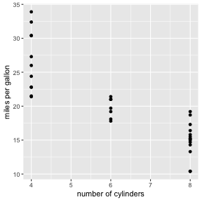
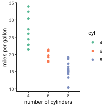
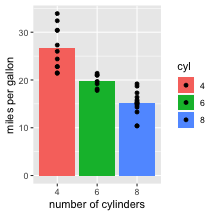

<style>
.title-slide {
  background-color: #bbbcce; /* #EDE0CF; ; #CA9F9D*/
}
strong {
  font-weight: bold;
}
em {
  font-style: italic
}
.title-slide hgroup > h1{
  font-family: 'Oswald';
}

.title-slide hgroup > h2{
  font-family: 'Oswald','Calibri';
}
slide:not(.segue) h2{
  font-family: Trebuchet MS; /*, 'Oswald', sans-serif; */
}
</style>


## Overview

week | topic
--------- |----------
may 24 | literature search & reference management
may 31    | R part I: syntax & data types
jun 7     | R part II: data import & cleaning with dplyr
**jun 14**    | **R part III: tidy data & plotting with ggplot2**
jun 21    | R part IV: R markdown & miscellaneous R topics
jun 28    | how to read a scientific paper
jul 5     | MATLAB part I: syntax, variables, data types
jul 12    | MATLAB part II: data manipulation, scripts, & functions
jul 19    | MATLAB part III: building a basic experiment
jul 26    | no tutorial
aug 2     | MATLAB part IV: building a basic experiment (cont.)
aug 9     | data lab: working with real data in R
aug 16    | data lab: TBA

--- .class #id

## Today

- Review of data manipulation with dplyr
- Tidy data
  - Definition and examples
  - Gather() and spread() functions
- Basic plotting with ggplot2

--- .class #id

## Review of dplyr

Last week, we were introduced to the **dplyr package**, its useful functions for manipulating and summarizing data, and the pipe operator: `%>%`.

Review of dplyr functions:
- `select()`: select variables to include in dataframe and, if desired, rename variables
- `rename()`: rename variables
- `filter()`: filter dataframe based on certain conditions
- `mutate()`: create new variables
- `summarize()`: summarize certain variables

--- .class #id

## Review of dplyr (cont.)

Here is an example of how we might use these commands to (a) manipulate data and then (b) summarize it.

First, we load the `iris` dataset, which is one of the built-in datasets in R. It includes measures of sepal and petal width and height for flowers from different iris species.


```r
data(iris)
str(iris)
```

```
## 'data.frame':	150 obs. of  5 variables:
##  $ Sepal.Length: num  5.1 4.9 4.7 4.6 5 5.4 4.6 5 4.4 4.9 ...
##  $ Sepal.Width : num  3.5 3 3.2 3.1 3.6 3.9 3.4 3.4 2.9 3.1 ...
##  $ Petal.Length: num  1.4 1.4 1.3 1.5 1.4 1.7 1.4 1.5 1.4 1.5 ...
##  $ Petal.Width : num  0.2 0.2 0.2 0.2 0.2 0.4 0.3 0.2 0.2 0.1 ...
##  $ Species     : Factor w/ 3 levels "setosa","versicolor",..: 1 1 1 1 1 1 1 1 1 1 ...
```

--- .class #id

## Review of dplyr (cont.)

Next, we use dplyr functions to perform several manipulations on the data:


```r
iris_new <- iris %>%
  select(length = Petal.Length, width = Petal.Width, Species) %>%
  filter(length > 3.0) %>%
  mutate(width_name = ifelse(width > 2.0, 'wide', 'narrow'))

head(iris_new, 5)
```

```
##   length width    Species width_name
## 1    4.7   1.4 versicolor     narrow
## 2    4.5   1.5 versicolor     narrow
## 3    4.9   1.5 versicolor     narrow
## 4    4.0   1.3 versicolor     narrow
## 5    4.6   1.5 versicolor     narrow
```

--- .class #id

## Review of dplyr (cont.)

Finally, we can summarize certain variables within the manipulated data. For instance, if we wanted to calculate the mean petal length and width by species:


```r
iris_new %>%
  group_by(Species) %>%
  summarize(mean_length = mean(length, na.rm = TRUE),
            mean_width = mean(width, na.rm = TRUE))
```

```
## # A tibble: 2 x 3
##   Species    mean_length mean_width
##   <fct>            <dbl>      <dbl>
## 1 versicolor        4.29       1.33
## 2 virginica         5.55       2.03
```

--- .class #id

## Tidy data

**What is tidy data?**
- Every row contains an observation
- Every column is a variable
- Everything you need for an analysis is confined to one dataset

**Example of tidy data**


```
##             car  mpg cyl
## 1     Mazda RX4 21.0   6
## 2 Mazda RX4 Wag 21.0   6
## 3    Datsun 710 22.8   4
```

--- .class #id

## Tidy vs. untidy data

**Features of untidy data**
- Multiple variables in a single column (*as below*)
- Multiple observations in a single row
- Column labels are not variable labels, but observations or values
- Having multiple dataframes for a single analysis

**Example of untidy data**


```
##                 car variable value
## 1         Mazda RX4      mpg  21.0
## 2     Mazda RX4 Wag      mpg  21.0
## 3        Datsun 710      mpg  22.8
## 4    Hornet 4 Drive      mpg  21.4
## 5 Hornet Sportabout      mpg  18.7
## 6           Valiant      mpg  18.1
```

--- .class #id

## Converting untidy to tidy data

It is rarely the case that we are given tidy data to do an analysis. Most of the time, we will need to clean up untidy data and make it tidy, in order to do analysis and plotting in R. This process of **tidying** is what we will focus on for the next part of today's tutorial. (See [this paper] (http://vita.had.co.nz/papers/tidy-data.html) by Hadley Wickham for a lengthier discussion of tidy data.)

*However, it is worth noting that if you are creating an experiment or a way to collect data, you will save yourself time upfront by storing the resulting data in a tidy format.*

**The tidyr package contains several helpful functions:**
- `gather()`: collapses multiple columns into fewer columns, based on a key-value pair
- `spread()`: spreads a dataframe into more columns, based on a key-value pair

Let's practice in R: open RStudio, navigate to the [script](https://raw.githubusercontent.com/shelbybachman/RA-tutorial-2019/master/04-R_part3/R_part3.R) for this lecture, and copy the script text into a new R script.

--- .class #id

## Introduction to ggplot2

In the first week of the tutorial, we learned to create basic plots using the base R functions (`hist()`, `plot()`, `boxplot()`). As an alternative to these options, the `ggplot2` package is widely used to create aesthetically-pleasing plots with simple syntax and significant flexibility. 

The syntax for `ggplot2` is based on the **grammar of graphics**. The idea is that you build a plot in a consistent way: using a data source, a coordinate system, and visual elements that represent your data (*geoms*). I think of the process as follows:
- First, create a ggplot object specifying the data and variables to be plotted
- Then, add (`+`) layers to the plot, which can include:
  - Plot (*geom*) type(s) (dot, line, bar, boxplot, etc.)
  - Color themes
  - Scale information for the axes
  - Axis label and title information
  - And much more!

--- .class #id

## ggplot2: basic example
  
1. Create ggplot object with `ggplot()`
2. Add layers to plot with `+` operator

Below I create a dot plot of miles per gallon vs. number of cylinders. 
  

```r
ggplot(data = mtcars, aes(x = cyl, y = mpg)) +
  geom_point() +
  labs(x = 'number of cylinders', y = 'miles per gallon')
```



--- .class #id

## ggplot2: grouping & aesthetics

Suppose now we want to color the data points according to number of cylinders. Let's also change the overall theme of the plot. (We'll visit more themes later in today's tutorial.)


```r
ggplot(data = mtcars, aes(x = factor(cyl), y = mpg, colour = factor(cyl))) +
  geom_point() +
  labs(x = 'number of cylinders', y = 'miles per gallon', colour = 'cyl') +
  scale_colour_brewer(palette = 'Set2') +
  theme_classic()
```



--- .class #id

## ggplot2: combining geoms

Often times we want to show a summary of the data (i.e. means) with individual data points.


```r
mtcars_summary <- mtcars %>% 
  group_by(cyl) %>%
  summarize(mpg = mean(mpg, na.rm = TRUE))

ggplot(data = mtcars_summary, aes(x = factor(cyl), y = mpg, fill = factor(cyl))) +
  geom_bar(stat = "identity") +
  geom_point(data = mtcars) +
  labs(x = 'number of cylinders', y = 'miles per gallon', fill = 'cyl')
```



--- .class #id

## More resources on tidy data & ggplot2

[Tidy Data] (https://ramnathv.github.io/pycon2014-r/explore/tidy.html) 

[ggplot2 tutorial] (http://r-statistics.co/Complete-Ggplot2-Tutorial-Part1-With-R-Code.html)

[ggplot2 cheat sheet](https://github.com/rstudio/cheatsheets/blob/master/data-visualization-2.1.pdf)

Now, let's get started making our own plots with ggplot2...
